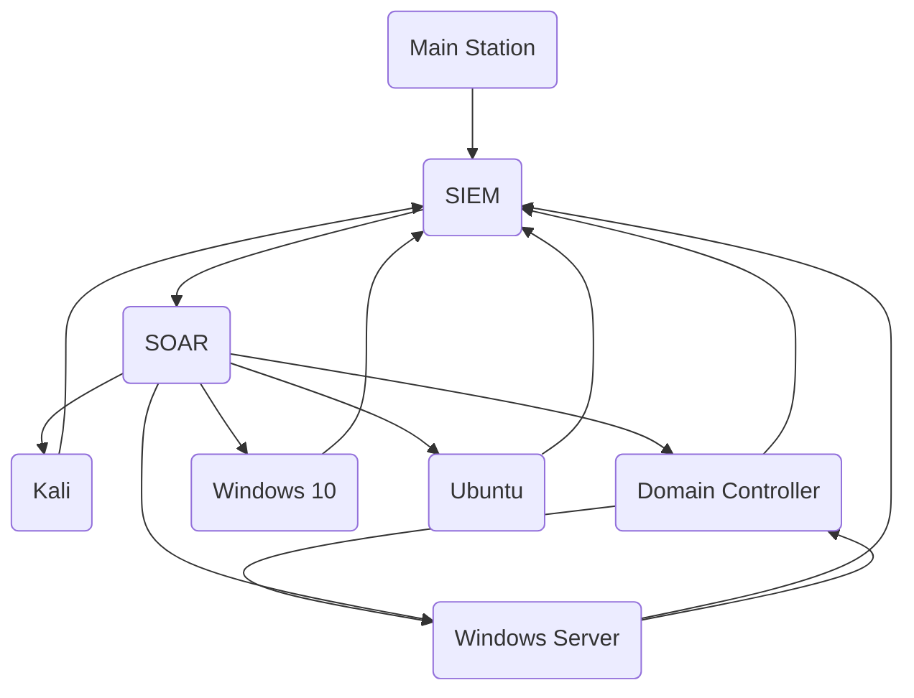

# Personal GitHub Repository


Welcome to my personal GitHub repository! This space will showcase projects and contributions related to cybersecurity research, threat intelligence, reverse engineering, and more. Below is a summary of what you'll find here.

---

## Projects and Areas of Focus

### 1. **Cybersecurity Research & Threat Intelligence**
   - Research reports on emerging cyber threats.
   - Analysis of attack vectors and mitigation strategies.
   - Example projects: Threat modeling, incident reports, and more.

### 2. **Reverse Engineering & Malware Analysis**
   - Dissection of malware, reverse engineering analysis, and binary exploitation.
   - Example projects: Malware behavior breakdowns, code analysis of real-world samples.

### 3. **Capture The Flag (CTF) Challenges**
   - Solutions to CTF problems, ranging from cryptography to reverse engineering.
   - Step-by-step guides to common CTF challenges and lessons learned.

### 4. **Scripting and Automation**
   - Developing automated tasks
   - Building specialized scripts to address specific security challenges.

### 5. **Other**
   - Free certification/courses
   - Tools recommandations
   - Testing Lab

---

## Testing Lab


---

## How to Contribute
If you're passionate about cybersecurity, feel free to contribute to my projects or get in touch! I'm open to collaboration on new research or reverse engineering challenges.

---
## Contact

<a href="https://x.com/learntocatch" target="_blank">   </a>  <a href="mailto:c-m-p-c@hotmail.com">   
</a>   


---
Thank you for visiting my GitHub repository! Stay secure and keep exploring the world of cybersecurity.
**CMPC** - Protect. Analyze. Innovate.

```
