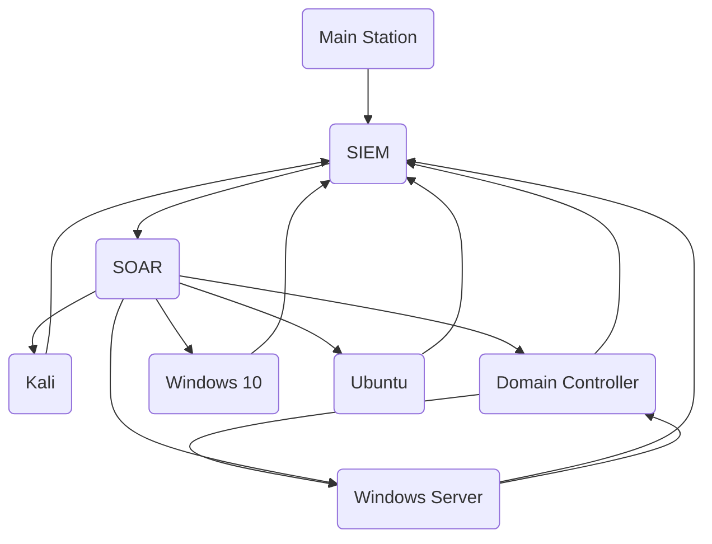

# Personal GitHub Repository

Welcome to my personal GitHub repository! This space will showcase projects and contributions related to cybersecurity research, threat intelligence, reverse engineering, and more. Below is a summary of what you'll find here.

---

## 🚀 Projects and Areas of Focus

### 1. **🔐 Cybersecurity Research & Threat Intelligence**
   - Research reports on emerging cyber threats.
   - Analysis of attack vectors and mitigation strategies.
   - Example projects: Threat modeling, incident reports, and more.

### 2. **Reverse Engineering & Malware Analysis**
   - Dissection of malware, reverse engineering analysis, and binary exploitation.
   - Example projects: Malware behavior breakdowns, code analysis of real-world samples.

### 3. **Capture The Flag (CTF) Challenges**
   - Solutions to CTF problems, ranging from cryptography to reverse engineering.
   - Step-by-step guides to common CTF challenges and lessons learned.

### 4. **🤖 Scripting and Automation**
   - Developing automated tasks
   - Building specialized scripts to address specific security challenges.

### 5. **Free certification**

   Area of interest  | Name | Link
   ------------- | ------------- | -------------
   Cyber Security  | ISC2 - Certified in Cybersecurity  | <a href="https://www.isc2.org/landing/1mcc" target="_blank" style="color: blue; font-weight: bold;">Click here</a>
   Cyber Security  | ArcX - Cyber Threat Intelligence 101  | <a href="https://arcx.io/courses/cyber-threat-intelligence-101" target="_blank" style="color: blue; font-weight: bold;">Click here</a>

 ### 6. **Tools recommandations**

 Area of interest  | Name | Description | Link
   ------------- | ------------- | ------------- | -------------
   OSINT  | Pentester | Discover digital footprint | <a href="https://pentester.com/" target="_blank" style="color: blue; font-weight: bold;">Click here</a>
   OSINT | Social-Analyzer | Discover digital footprint | <a href="https://github.com/qeeqbox/social-analyzer" target="_blank" style="color: blue; font-weight: bold;">Click here</a>
   Forensics  | WhoYouCalling | Monitors network | <a href="https://github.com/H4NM/WhoYouCalling" target="_blank" style="color: blue; font-weight: bold;">Click here</a>
   Honeypot | tpotce | All in one honeypot | <a href="https://github.com/telekom-security/tpotce" target="_blank" style="color: blue; font-weight: bold;">Click here</a>
   
---

## Testing Lab

---

## 🤝 How to Contribute
If you're passionate about cybersecurity, feel free to contribute to my projects or get in touch! I'm open to collaboration on new research or reverse engineering challenges.

---
## 📞 Contact

     

---
Thank you for visiting my GitHub repository! Stay secure and keep exploring the world of cybersecurity.
**CMPC** - Protect. Analyze. Innovate.

